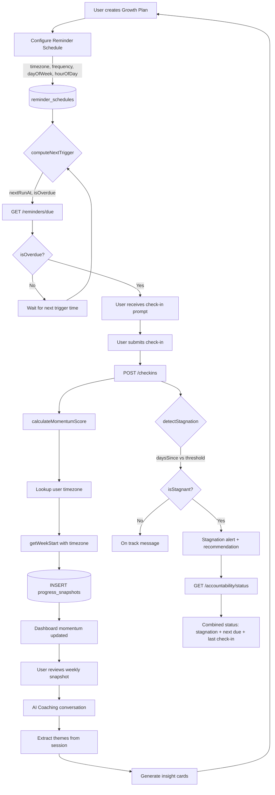

# Accountability Loop

```mermaid
flowchart TD
    A[User creates Growth Plan] --> B[Configure Reminder Schedule]
    B -->|timezone, frequency, dayOfWeek, hourOfDay| C[(reminder_schedules)]

    C --> D{computeNextTrigger}
    D -->|nextRunAt, isOverdue| E[GET /reminders/due]

    E --> F{isOverdue?}
    F -->|No| G[Wait for next trigger time]
    G --> D

    F -->|Yes| H[User receives check-in prompt]
    H --> I[User submits check-in]
    I --> J[POST /checkins]

    J --> K[calculateMomentumScore]
    K --> L[Lookup user timezone]
    L --> M[getWeekStart with timezone]
    M --> N[(INSERT progress_snapshots)]
    N --> O[Dashboard momentum updated]

    J --> P{detectStagnation}
    P -->|daysSince vs threshold| Q{isStagnant?}
    Q -->|No| R[On track message]
    Q -->|Yes| S[Stagnation alert + recommendation]

    S --> T[GET /accountability/status]
    T --> U[Combined status: stagnation + next due + last check-in]

    O --> V[User reviews weekly snapshot]
    V --> W[AI Coaching conversation]
    W --> X[Extract themes from session]
    X --> Y[Generate insight cards]
    Y --> A
```
