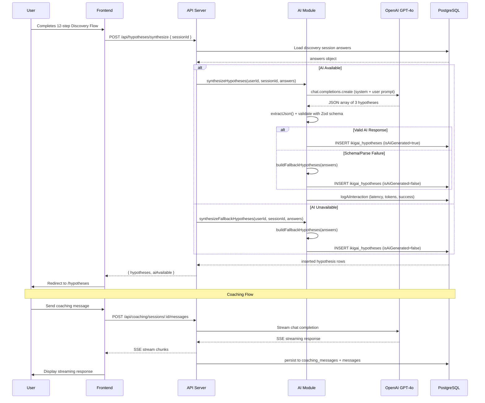

# AI Interaction Sequence

```mermaid
sequenceDiagram
    participant User
    participant Frontend
    participant API as API Server
    participant AI as AI Module
    participant GPT as OpenAI GPT-4o
    participant DB as PostgreSQL

    User->>Frontend: Completes 12-step Discovery Flow
    Frontend->>API: POST /api/hypotheses/synthesize { sessionId }
    API->>DB: Load discovery session answers
    DB-->>API: answers object

    alt AI Available
        API->>AI: synthesizeHypotheses(userId, sessionId, answers)
        AI->>GPT: chat.completions.create (system + user prompt)
        GPT-->>AI: JSON array of 3 hypotheses
        AI->>AI: extractJson() + validate with Zod schema
        alt Valid AI Response
            AI->>DB: INSERT ikigai_hypotheses (isAiGenerated=true)
        else Schema/Parse Failure
            AI->>AI: buildFallbackHypotheses(answers)
            AI->>DB: INSERT ikigai_hypotheses (isAiGenerated=false)
        end
        AI->>DB: logAiInteraction (latency, tokens, success)
    else AI Unavailable
        API->>AI: synthesizeFallbackHypotheses(userId, sessionId, answers)
        AI->>AI: buildFallbackHypotheses(answers)
        AI->>DB: INSERT ikigai_hypotheses (isAiGenerated=false)
    end

    DB-->>API: inserted hypothesis rows
    API-->>Frontend: { hypotheses, aiAvailable }
    Frontend->>User: Redirect to /hypotheses

    Note over User,DB: Coaching Flow
    User->>Frontend: Send coaching message
    Frontend->>API: POST /api/coaching/sessions/:id/messages
    API->>GPT: Stream chat completion
    GPT-->>API: SSE streaming response
    API-->>Frontend: SSE stream chunks
    API->>DB: persist to coaching_messages + messages
    Frontend->>User: Display streaming response
```
