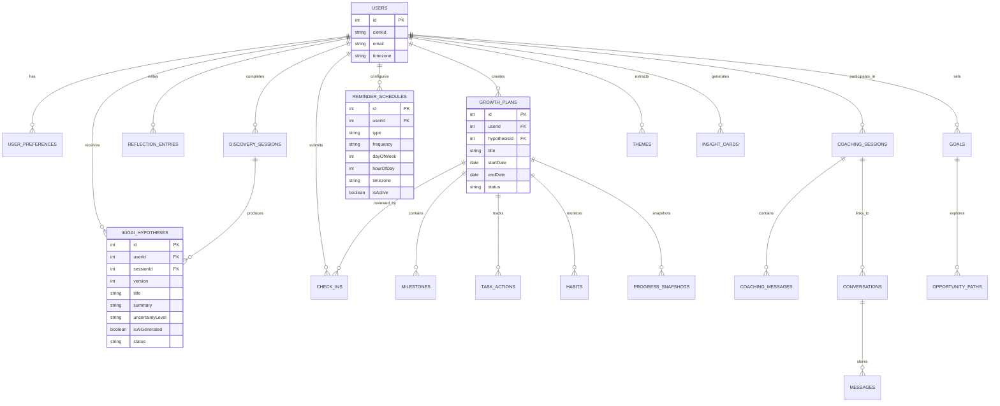

# Domain Model

```mermaid
erDiagram
    USERS ||--o{ USER_PREFERENCES : has
    USERS ||--o{ DISCOVERY_SESSIONS : completes
    USERS ||--o{ REFLECTION_ENTRIES : writes
    USERS ||--o{ IKIGAI_HYPOTHESES : receives
    USERS ||--o{ GROWTH_PLANS : creates
    USERS ||--o{ COACHING_SESSIONS : participates_in
    USERS ||--o{ CHECK_INS : submits
    USERS ||--o{ REMINDER_SCHEDULES : configures
    USERS ||--o{ GOALS : sets
    USERS ||--o{ THEMES : extracts
    USERS ||--o{ INSIGHT_CARDS : generates

    DISCOVERY_SESSIONS ||--o{ IKIGAI_HYPOTHESES : produces
    GROWTH_PLANS ||--o{ MILESTONES : contains
    GROWTH_PLANS ||--o{ TASK_ACTIONS : tracks
    GROWTH_PLANS ||--o{ HABITS : monitors
    GROWTH_PLANS ||--o{ CHECK_INS : reviewed_by
    GROWTH_PLANS ||--o{ PROGRESS_SNAPSHOTS : snapshots

    COACHING_SESSIONS ||--o{ COACHING_MESSAGES : contains
    COACHING_SESSIONS ||--o{ CONVERSATIONS : links_to

    CONVERSATIONS ||--o{ MESSAGES : stores

    GOALS ||--o{ OPPORTUNITY_PATHS : explores

    USERS {
        int id PK
        string clerkId
        string email
        string timezone
    }

    IKIGAI_HYPOTHESES {
        int id PK
        int userId FK
        int sessionId FK
        int version
        string title
        string summary
        string uncertaintyLevel
        boolean isAiGenerated
        string status
    }

    GROWTH_PLANS {
        int id PK
        int userId FK
        int hypothesisId FK
        string title
        date startDate
        date endDate
        string status
    }

    REMINDER_SCHEDULES {
        int id PK
        int userId FK
        string type
        string frequency
        int dayOfWeek
        int hourOfDay
        string timezone
        boolean isActive
    }
```
