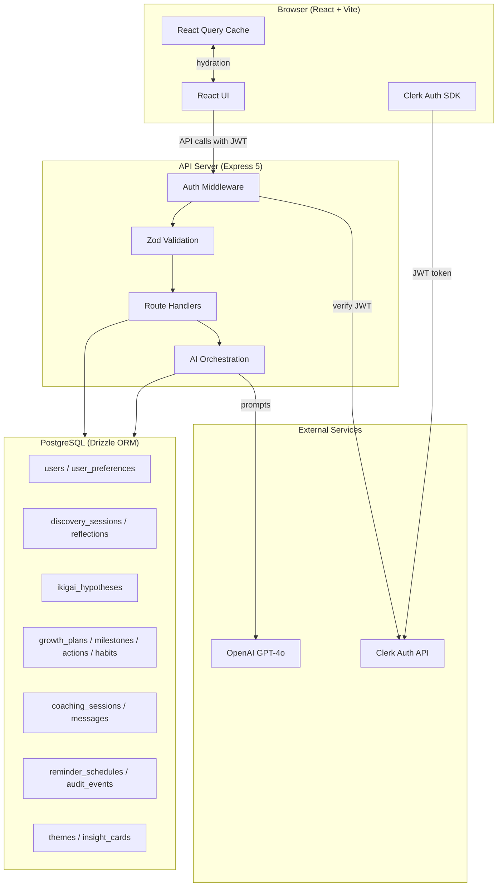

# System Architecture

```mermaid
graph TB
    subgraph Client["Browser (React + Vite)"]
        UI[React UI]
        RC[React Query Cache]
        Auth[Clerk Auth SDK]
    end

    subgraph API["API Server (Express 5)"]
        MW[Auth Middleware]
        Routes[Route Handlers]
        AI[AI Orchestration]
        Val[Zod Validation]
    end

    subgraph DB["PostgreSQL (Drizzle ORM)"]
        Users[users / user_preferences]
        Discovery[discovery_sessions / reflections]
        Hypotheses[ikigai_hypotheses]
        Growth[growth_plans / milestones / actions / habits]
        Coaching[coaching_sessions / messages]
        Schedule[reminder_schedules / audit_events]
        Insights[themes / insight_cards]
    end

    subgraph External["External Services"]
        ClerkAPI[Clerk Auth API]
        OpenAI[OpenAI GPT-4o]
    end

    UI -->|API calls with JWT| MW
    Auth -->|JWT token| ClerkAPI
    MW -->|verify JWT| ClerkAPI
    MW --> Val
    Val --> Routes
    Routes --> AI
    Routes --> DB
    AI -->|prompts| OpenAI
    AI --> DB
    RC <-->|hydration| UI
```
