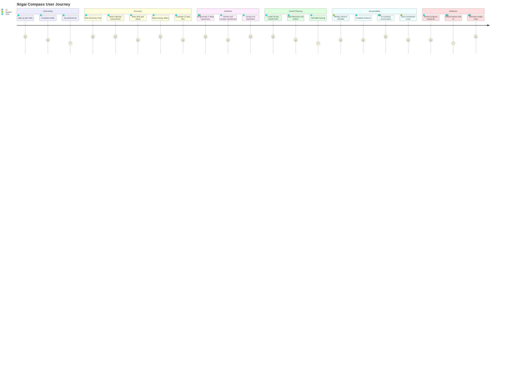

# User Journey

```mermaid
journey
    title Ikigai Compass User Journey
    section Onboarding
        Sign up with Clerk: 5: User
        Complete profile: 4: User
        Set preferences: 3: User
    section Discovery
        Start Discovery Flow: 5: User
        Select interests (card-select): 5: User
        Rate skills and values: 4: User
        Adjust energy sliders: 5: User
        Complete 12-step flow: 4: User
    section Synthesis
        AI generates 3 Ikigai hypotheses: 5: User, AI
        Review and compare hypotheses: 4: User
        Accept one hypothesis: 5: User
    section Growth Planning
        Create 90-day Growth Plan: 5: User
        Add milestones and actions: 4: User
        Set habit tracking: 3: User
    section Accountability
        Weekly check-in reminder: 4: System
        Complete check-in: 4: User
        AI coaching conversation: 5: User, AI
        Track momentum score: 4: System
    section Reflection
        Review progress snapshots: 4: User
        Extract themes with AI: 3: User, AI
        Generate insight cards: 5: User, AI
```
